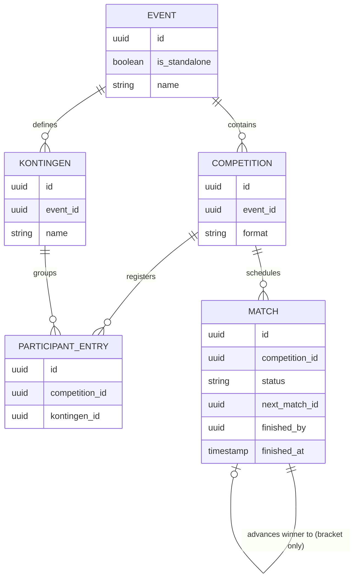
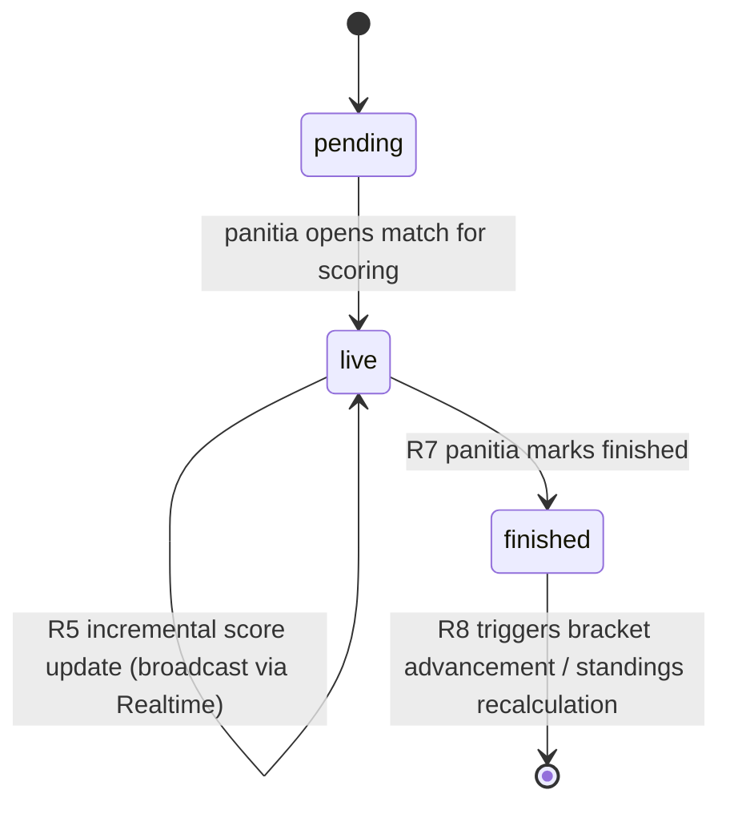

# Live Data Engine - Plan

## Goal Capsule

- **Objective:** Give panitia/admin a live, single-source data engine for tournament scoring — standalone tournaments by default, with an optional Event wrapper for multi-competition programs (e.g. an Olympiad-style program) that groups participants into Kontingen.
- **Product authority:** `STRATEGY.md` — Target problem (manual bracket updates, WA question spam, disputed results) and Our approach (real-time transparency via bracket automation and audit trail).
- **Execution profile:** Standard. Greenfield build — the repo has no backend infrastructure yet (no database, no realtime library); this plan establishes both.
- **Open blockers:** None — Product Contract preservation: unchanged from the requirements-only version. Panitia authentication mechanism is an explicit assumption (Supabase Auth, email+password) rather than a blocker; full auth requirements are out of scope (see Scope Boundaries).

---

## Product Contract

### Summary

A live data engine where panitia/admin enter scores in real time (per point/goal) during a match, then explicitly mark the match finished to trigger bracket advancement or standings updates. Tournaments are standalone by default (one Competition, one bracket or league); an optional Event entity wraps multiple Competitions and groups participants into Kontingen for cross-competition aggregation.

### Problem Frame

Panitia currently run tournaments through spreadsheets and WhatsApp. This produces three concrete failures named in `STRATEGY.md`: brackets get updated incorrectly and players dispute the result, panitia field the same score questions repeatedly from players and spectators, and final results are doubted because there's no auditable record of how they were reached. The pain compounds when an event contains several competitions at once (e.g. a multi-sport program), because there is today no shared structure for grouping participants across competitions or aggregating their combined standing.

### Key Decisions

- **Event is an explicit entity, not a tag or a nullable parent reference.** A standalone tournament is modeled internally as an Event containing exactly one Competition, with the Event layer hidden from panitia UI. This keeps Kontingen aggregation consistent from day one instead of requiring a later migration, at the cost of carrying the Event/Competition split even for the common single-tournament case.
- **Match completion is a manual panitia action, not inferred from score rules.** A "mark finished" action by panitia is what triggers bracket advancement or standings recalculation. This avoids needing to encode win conditions per sport/game (best-of-N, time limits, etc.) in the engine.
- **Only panitia/admin can enter scores.** No separate referee role in this engine. Score entry, live updates, and marking a match finished are all panitia actions.
- **Audit trail captures the finished-match snapshot, not every live score tick.** Each match's audit record is who marked it finished, when, and the final score — not a log of every point/goal entered while the match was live. This keeps the audit surface small for the first version; live in-progress disputes have no granular record, only the final snapshot.
- **Kontingen scoring/medal rules are out of scope for this plan.** How competition placements convert into Kontingen points or medals is unresolved and explicitly deferred (see Scope Boundaries).

### Actors

- A1. **Panitia/admin** — creates tournaments/events, manages competitions, enters live scores, marks matches finished. The only actor with write access to match data.
- A2. **Pemain (player/participant)** — registered into a Competition (and, when applicable, a Kontingen); views live data as a read-only consumer.
- A3. **Penonton (spectator/public)** — anonymous read-only consumer of live bracket/standings/scores.

### Requirements

**Tournament and Event structure**

- R1. A panitia can create a standalone tournament (single Competition) without ever interacting with Event or Kontingen concepts.
- R2. A panitia can optionally create an Event containing multiple Competitions.
- R3. Within an Event, a panitia can define Kontingen and assign participants to a Kontingen when registering them into a Competition.
- R4. Each Competition independently uses either a bracket format (single/double elimination) or a league format (round-robin/standings table).

**Live scoring**

- R5. A panitia can update a match's score incrementally (per point/goal/round) while the match is in progress.
- R6. Live score updates are visible to Pemain and Penonton as they happen, without requiring a page refresh cadence slower than the update itself.
- R7. A panitia can explicitly mark a match as finished with a final score.
- R8. Marking a match finished triggers bracket advancement (winner moves to the next bracket slot) for bracket-format Competitions, or a standings recalculation for league-format Competitions.
- R9. Before a match is marked finished, its live score does not affect bracket advancement or standings.

**Audit trail**

- R10. Each match records who marked it finished, when, and the final score.
- R11. The audit record does not include a per-point/per-goal change history while the match was live.

### Key Flows

- F1. **Standalone tournament live match**
  - **Trigger:** Panitia opens a match and begins entering live scores.
  - **Actors:** A1, A2, A3
  - **Steps:** Panitia updates score incrementally as the match progresses (R5) → Pemain/Penonton see updates in real time (R6) → panitia marks the match finished with final score (R7) → bracket/standings update automatically (R8).
  - **Covers:** R1, R5, R6, R7, R8, R9

- F2. **Event with Kontingen aggregation**
  - **Trigger:** Panitia creates an Event with multiple Competitions and registers participants under Kontingen.
  - **Actors:** A1, A2, A3
  - **Steps:** Panitia creates Event (R2) → creates Competitions inside it, each with its own format (R4) → assigns participants to Kontingen during registration (R3) → each Competition runs its own live-match flow (F1) independently.
  - **Covers:** R2, R3, R4

### Scope Boundaries

**Deferred for later**

- Kontingen point/medal scoring rules (how competition placement converts to Kontingen standings) — unresolved, needs its own decision before it can be planned.
- Automatic win-condition detection per sport/game — explicitly not built; panitia always marks matches finished manually.
- Per-point/per-goal audit history during a live match — only the finished-match snapshot is recorded.
- Full panitia authentication requirements (registration flow, account management, password reset) — this plan assumes Supabase Auth email+password exists and is usable, but does not design the signup/account-management surface.

**Outside this engine's identity**

- A referee/wasit role with scoped write access — all score entry stays with panitia/admin in this plan.

---

## Planning Contract

### Key Technical Decisions

- **KTD1. Supabase (Postgres + Realtime) as the combined database and push mechanism.** Chosen over a custom Server-Sent Events Route Handler. Next.js 16 has no new built-in realtime primitive — SSE is still a hand-rolled `ReadableStream` in a Route Handler, which on serverless deployments requires managing reconnects and function-duration limits (Vercel Node-runtime functions cap at 300s–1800s depending on plan/tier). Supabase Realtime supports public, unauthenticated broadcast/postgres-changes channels, matching R6's no-refresh-cadence requirement and the public-transparency plan's no-login requirement, without custom connection-lifecycle code. *(See Sources & Research.)*
- **KTD2. Supabase client SDK directly, no ORM layer.** Drizzle or another ORM would add schema-migration tooling and type generation on top of Supabase's own migration and generated-types support. For a first version with a small, stable schema (Event/Competition/Match/Kontingen), the SDK's query builder plus Supabase's generated TypeScript types is sufficient; an ORM can be introduced later if schema complexity grows.
- **KTD3. Match state machine: `pending` → `live` → `finished`.** A match starts `pending` (not yet started), moves to `live` when panitia opens it for scoring (enables R5 live updates), and moves to `finished` only via the explicit panitia action in R7. Bracket advancement (R8) and the R9 non-leak rule both key off the transition into `finished`, not off score values.
- **KTD4. Standalone tournament is an Event row with `is_standalone: true` and exactly one Competition.** Implements the Key Decision that Event is always present internally. UI query helpers hide Event-level navigation whenever `is_standalone` is true, satisfying R1 without a second data model.
- **KTD5. Bracket advancement and standings recalculation run as a database function triggered on the `finished` transition, not as client-side logic.** Keeps R8/R9 correct regardless of which client (panitia dashboard, future admin tools) triggers the transition, and keeps the invariant enforceable at the data layer rather than duplicated per caller.
- **KTD6. Row Level Security (RLS) enforces the write boundary from Actors/A1.** Postgres RLS policies restrict INSERT/UPDATE on `matches` (score fields, finished-marking) to authenticated panitia rows scoped to their own tournament/event; SELECT is open to anon role for all match, bracket, and standings tables, satisfying A2/A3's read-only public access without an application-layer permission check.

### High-Level Technical Design

### Assumptions

- Panitia authentication exists via Supabase Auth (email+password) before this plan's units are exercised end-to-end; account creation/management flows are out of scope here (see Scope Boundaries) but a minimal panitia login must exist for RLS-gated writes to be testable.
- A single Supabase project (one Postgres instance, one Realtime service) is sufficient for this stage — no multi-tenant database sharding.

### Sequencing

U1 (schema + RLS) blocks everything else. U2 (Event/Competition CRUD) and U3 (Kontingen) can proceed in parallel once U1 lands. U4 (live scoring + Realtime) depends on U1–U3. U5 (bracket advancement) and U6 (standings recalculation) both depend on U4 and can proceed in parallel. U7 (Realtime client wiring) depends on U4.

---

## Implementation Units

### U1. Database schema and Row Level Security

- **Goal:** Establish the Postgres schema (Event, Competition, Kontingen, ParticipantEntry, Match) and RLS policies enforcing the panitia-only write / public-read boundary.
- **Requirements:** R1, R2, R3, R4, R10, R11 (A1, A2, A3)
- **Dependencies:** None.
- **Files:**
  - `supabase/migrations/0001_core_schema.sql` (new)
  - `supabase/migrations/0002_rls_policies.sql` (new)
  - `src/lib/supabase/types.ts` (new — generated Supabase types)
- **Approach:** Tables: `events` (`is_standalone` boolean, `name`), `competitions` (`event_id` FK, `format` enum: `bracket_single`, `bracket_double`, `league`), `kontingen` (`event_id` FK, `name`), `participant_entries` (`competition_id` FK, `kontingen_id` nullable FK), `matches` (`competition_id` FK, `status` enum: `pending`/`live`/`finished`, score fields, `next_match_id` self-referencing nullable FK for bracket advancement, `finished_by` FK to panitia user, `finished_at` timestamp). A `match_corrections` table is deferred to the Audit & Trust plan and not created here. RLS: `matches` INSERT/UPDATE restricted to authenticated users associated with the owning event/competition; SELECT open to `anon` and `authenticated` on all tables. `is_standalone` is set at Event creation and never changes. This unit also installs and configures Vitest + React Testing Library as the repo's test runner (none exists yet in `package.json`), since it's a prerequisite for this and every other unit's test scenarios.
- **Patterns to follow:** None — greenfield; establishes the schema conventions the rest of the plan follows.
- **Test scenarios:**
  - Happy path: an authenticated panitia row can INSERT a match under a competition they own; SELECT on `matches` succeeds for an anonymous (anon-role) client.
  - Edge case: a panitia authenticated but not associated with a given event's competitions cannot UPDATE that competition's matches (RLS denies).
  - Error path: anon-role client attempting INSERT/UPDATE on `matches` is rejected by RLS, not by application code.
  - Integration: creating a standalone tournament produces exactly one `events` row (`is_standalone = true`) and one `competitions` row, verifying KTD4's single-Competition invariant.
- **Verification:** Run migrations against a local/staging Supabase instance; confirm RLS policies via Supabase's policy test queries or direct `psql` role-switched queries reproducing the scenarios above.

### U2. Event and Competition management

- **Goal:** Let panitia create standalone tournaments and multi-Competition Events, with Event-level navigation hidden for standalone tournaments.
- **Requirements:** R1, R2, R4 (A1)
- **Dependencies:** U1.
- **Files:**
  - `src/app/(panitia)/events/new/page.tsx` (new)
  - `src/app/(panitia)/events/[eventId]/page.tsx` (new)
  - `src/lib/tournaments/create-event.ts` (new)
  - `src/lib/tournaments/create-event.test.ts` (new)
- **Approach:** A single "create tournament" server action creates an Event row with `is_standalone: true` plus one Competition when the panitia doesn't explicitly opt into multi-competition mode; opting in creates an Event with `is_standalone: false` and lets panitia add further Competitions afterward. Route params follow Next.js 16 async-params convention (`await params`).
- **Patterns to follow:** Next.js 16 Server Actions convention (`'use server'`) per `node_modules/next/dist/docs` — see Sources & Research.
- **Test scenarios:**
  - Happy path: creating a standalone tournament produces one Event (`is_standalone: true`) and one Competition with the chosen format.
  - Happy path: creating a multi-competition Event, then adding a second Competition, results in two Competition rows under one Event (`is_standalone: false`).
  - Edge case: attempting to add a Competition to an Event where `is_standalone: true` is rejected (invariant from KTD4).
- **Verification:** Unit tests on `create-event.ts` cover both creation paths and the standalone-invariant rejection.

### U3. Kontingen and participant registration

- **Goal:** Let panitia define Kontingen within an Event and assign participants to a Kontingen when registering them into a Competition.
- **Requirements:** R3 (A1, A2)
- **Dependencies:** U1, U2.
- **Files:**
  - `src/app/(panitia)/events/[eventId]/kontingen/page.tsx` (new)
  - `src/lib/tournaments/register-participant.ts` (new)
  - `src/lib/tournaments/register-participant.test.ts` (new)
- **Approach:** Kontingen CRUD scoped to a non-standalone Event. Registering a participant into a Competition optionally attaches a `kontingen_id`; standalone tournaments never expose this field since their Event has no Kontingen.
- **Patterns to follow:** Server Actions convention established in U2.
- **Test scenarios:**
  - Happy path: registering a participant into a Competition with a Kontingen selected persists the `kontingen_id` on `participant_entries`.
  - Edge case: registering a participant with no Kontingen selected (optional per R3) succeeds with `kontingen_id: null`.
  - Integration: a participant registered into two different Competitions within the same Event under the same Kontingen is queryable as one Kontingen across both.
- **Verification:** Unit tests on `register-participant.ts` covering both scenarios above.

### U4. Live scoring and real-time broadcast

- **Goal:** Let panitia update a match's score incrementally while live, with updates reaching viewers via Supabase Realtime without a refresh.
- **Requirements:** R5, R6, R9 (A1, A2, A3)
- **Dependencies:** U1, U2, U3.
- **Files:**
  - `src/app/(panitia)/matches/[matchId]/score/page.tsx` (new)
  - `src/lib/matches/update-live-score.ts` (new)
  - `src/lib/matches/update-live-score.test.ts` (new)
  - `src/hooks/use-live-match.ts` (new)
- **Approach:** A Server Action transitions a match from `pending` to `live` on first score entry, then updates score fields on each subsequent call. Supabase's `postgres_changes` Realtime feature broadcasts row updates on `matches` to subscribed clients automatically — no separate broadcast-publishing code needed beyond the UPDATE itself. `use-live-match.ts` is a client hook wrapping a Supabase Realtime channel subscription scoped to one match's row.
- **Technical design:** Directional sketch, not implementation-specified — `update-live-score(matchId, scoreDelta)`: load current match, assert `status != 'finished'`, apply delta, UPDATE row (triggers Realtime broadcast to subscribers), set `status = 'live'` if currently `pending`.
- **Patterns to follow:** Supabase Realtime `postgres_changes` subscription pattern (see Sources & Research); Next.js 16 Server Actions.
- **Test scenarios:**
  - Happy path: updating the score of a `pending` match transitions it to `live` and persists the new score.
  - Happy path: a second score update on an already-`live` match updates the score without changing status.
  - Edge case: updating the score of a `finished` match is rejected (guards R9 — no further live mutation once finished).
  - Integration: an UPDATE to a match's score row is observable by a subscribed Realtime client within the test's timeout window (proves the broadcast path, not just the DB write).
- **Verification:** Unit tests on `update-live-score.ts` for the state-transition and finished-guard scenarios; an integration test subscribing a test Realtime client and asserting it receives the update event.

### U5. Bracket advancement

- **Goal:** When a bracket-format match is marked finished, automatically advance the winner into the next bracket slot.
- **Requirements:** R7, R8, R9 (A1, A2, A3)
- **Dependencies:** U4.
- **Files:**
  - `supabase/migrations/0003_bracket_advancement_function.sql` (new)
  - `src/lib/matches/mark-finished.ts` (new)
  - `src/lib/matches/mark-finished.test.ts` (new)
- **Approach:** Per KTD5, advancement runs as a Postgres function/trigger fired on the `matches.status` transition to `finished` for competitions with `format IN ('bracket_single', 'bracket_double')`. The function reads `next_match_id`, determines the winning `participant_entry` from final scores, and writes it into the appropriate slot of the next match.
- **Technical design:** Directional sketch — trigger function pseudocode: `ON UPDATE OF status ON matches WHEN NEW.status = 'finished' AND OLD.status != 'finished': IF competition.format IN bracket formats AND NEW.next_match_id IS NOT NULL THEN determine_winner(NEW) -> slot into next_match_id's appropriate participant slot`.
- **Patterns to follow:** Postgres trigger/function conventions established in U1's migrations.
- **Test scenarios:**
  - Happy path: marking a bracket match finished with a clear winner populates the winner into the next match's empty participant slot.
  - Edge case: marking finished a match whose `next_match_id` is null (final match of the bracket) does not error and performs no advancement.
  - Edge case: marking finished a match in a league-format Competition does not trigger any bracket advancement logic (routes to U6 instead).
  - Error path: marking finished a match with a tied/ambiguous score (if the sport allows ties) surfaces a clear error rather than advancing an arbitrary participant.
- **Verification:** Database-level tests (via a test harness invoking the trigger function directly or through the `mark-finished` action) covering each scenario above.

### U6. Standings recalculation

- **Goal:** When a league-format match is marked finished, recalculate that Competition's standings table.
- **Requirements:** R7, R8, R9 (A1, A2, A3)
- **Dependencies:** U4.
- **Files:**
  - `supabase/migrations/0004_standings_recalculation_function.sql` (new)
  - `src/lib/competitions/get-standings.ts` (new)
  - `src/lib/competitions/get-standings.test.ts` (new)
- **Approach:** Standings are computed (not stored redundantly) as a query over finished matches in a league-format Competition — win/loss/draw counts and points per participant — rather than a mutable standings table, avoiding a second write path to keep in sync. `get-standings.ts` exposes this as a read function; Realtime subscribers to the Competition's matches recompute standings client-side on each finished-match event, or query fresh on load.
- **Patterns to follow:** Read-model-as-query pattern established here; no prior local pattern exists.
- **Test scenarios:**
  - Happy path: after two finished matches in a league Competition, `get-standings` returns correct win/loss/points per participant.
  - Edge case: a Competition with zero finished matches returns an empty/zeroed standings table, not an error.
  - Edge case: a live (not yet finished) match's score does not appear in standings (guards R9).
- **Verification:** Unit tests on `get-standings.ts` against seeded match data covering each scenario above.

### U7. Public live view data wiring

- **Goal:** Provide the read-side query and subscription helpers that the Public Transparency Layer plan's pages will consume, so Pemain/Penonton see live updates without login.
- **Requirements:** R6 (A2, A3)
- **Dependencies:** U4.
- **Files:**
  - `src/lib/matches/get-match-public.ts` (new)
  - `src/lib/matches/get-match-public.test.ts` (new)
  - `src/hooks/use-live-match.ts` (shared with U4)
- **Approach:** A read-only query function using the Supabase anon client (no auth) fetching a match's current state, plus the shared `use-live-match` hook for subscription. This unit exists to give the Public Transparency Layer plan a stable data-access seam to build pages against, without duplicating the Realtime wiring from U4.
- **Patterns to follow:** Supabase anon-client read pattern from U1's RLS design.
- **Test scenarios:**
  - Happy path: `get-match-public` returns full match state for any match regardless of caller authentication (anon client succeeds).
  - Integration: a client subscribed via `use-live-match` receives the same score update broadcast tested in U4, confirming the public read path shares the same Realtime channel.
- **Verification:** Unit test on `get-match-public.ts`; reuse of U4's Realtime integration test pattern for the subscription path.

---

## Verification Contract

| Command | Applies to | Notes |
|---|---|---|
| `npm run lint` | All units | ESLint via `eslint.config.mjs`; run before considering any unit complete. |
| `npx tsc --noEmit` | All units | Strict-mode type check per `tsconfig.json`. |
| Supabase migration apply (`supabase db reset` or equivalent against a local/staging project) | U1, U5, U6 | Confirms schema and trigger functions apply cleanly before application code depends on them. |
| `npx vitest run` | Each unit | Vitest + React Testing Library, installed as part of U1. |

## Definition of Done

- All seven units (U1–U7) implemented, with each unit's test scenarios passing.
- `npm run lint` and `npx tsc --noEmit` pass with no errors.
- RLS policies verified: an anon-role client can read but not write `matches`; an authenticated panitia can write only within their own event/competition scope.
- Bracket advancement (U5) and standings recalculation (U6) both verified against seeded multi-match scenarios, not just single-match cases.
- No dead-end or experimental code from abandoned approaches remains in the diff.
- Any deviation from this plan's Key Technical Decisions is called out explicitly rather than silently substituted.

---

## Sources & Research

- Next.js 16 breaking changes relevant to this plan (read from `node_modules/next/dist/docs/01-app/02-guides/upgrading/version-16.md` and `03-api-reference/route.md`): Route Handler `params` is now a Promise requiring `await`; GET handlers are dynamic by default (not statically cached) since v15; `fetch` is not memoized inside Route Handlers. No new built-in real-time push primitive exists in Next.js 16 — streaming is still a hand-rolled `ReadableStream`, which motivated KTD1's choice of Supabase Realtime over custom SSE.
- Real-time mechanism research: Supabase Realtime supports public/anonymous broadcast channels (`is_private: false`) requiring no auth, directly matching this plan's no-login public read requirement (R6, A3). WebSockets in Next.js App Router require a custom Node server (no persistent process available in Route Handlers to attach a `WebSocketServer`), making them operationally heavier than needed here. Vercel Node-runtime function duration limits (up to 300s–1800s depending on tier) would require reconnect/resume logic for a hand-rolled SSE approach — Supabase Realtime avoids this entirely.
- Database/query-layer research: Postgres + a lightweight client (Supabase SDK or Drizzle) is the common current pairing for new Next.js apps; this plan chose the Supabase SDK directly (KTD2) to avoid a second tool for a first-version schema of this size.
