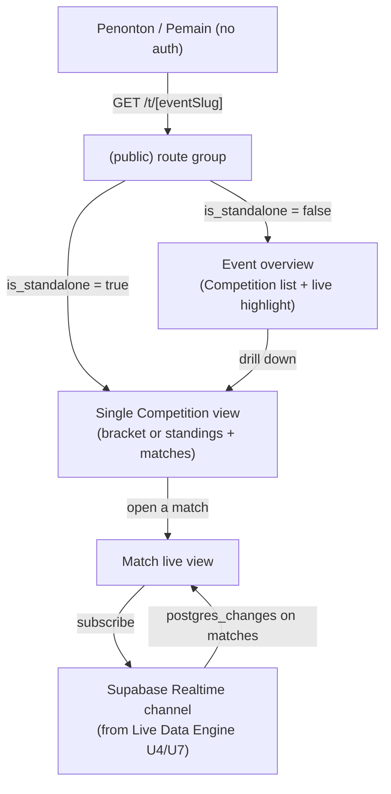

# Public Transparency Layer - Plan

## Goal Capsule

- **Objective:** Give penonton/pemain a read-only, no-login live view of tournaments and events, so everyone sees the same data panitia sees, without needing to ask panitia directly.
- **Product authority:** `STRATEGY.md` — Our approach (real-time transparency, one shared data source) and Track "Public transparency layer". Builds on [docs/plans/2026-07-01-001-feat-live-data-engine-plan.md](2026-07-01-001-feat-live-data-engine-plan.md) (Event/Competition/Kontingen structure, Supabase Realtime wiring, `get-match-public`/`use-live-match` from its U7).
- **Execution profile:** Standard. Builds on the Live Data Engine plan's schema and Realtime infrastructure rather than establishing new infrastructure.
- **Open blockers:** None — Product Contract preservation: unchanged, plus one additive field (`events.slug`) resolved during planning (see Key Technical Decisions).

---

## Product Contract

### Summary

A public, unauthenticated live view surfacing tournament and event data as it happens. Event pages list their Competitions and highlight currently in-progress matches across the whole Event; Competition pages show bracket or standings; match pages show live scores. Updates push to viewers automatically as panitia enters them — no refresh required.

### Problem Frame

Panitia currently field the same score/result questions repeatedly from players and spectators over WhatsApp, because there's no shared place for the public to look. `STRATEGY.md`'s approach bets on real-time transparency — everyone viewing the same data at the same time — as the mechanism that eliminates this. This layer is the public-facing half of that bet; the Live Data Engine plan covers how panitia produces the data this layer displays.

### Key Decisions

- **No authentication anywhere in this layer.** Every page here is visible to any viewer with the link — players, spectators, anyone. There's no personalized or logged-in variant. This keeps the layer simple and matches "transparency for the public" directly, at the cost of not supporting future personalized views (e.g., a kontingen-specific dashboard) without additional work.
- **Bracket and standings stay visually pending until a match is marked finished.** This mirrors R9 from the Live Data Engine plan: live in-progress scores are visible on the match's own page, but don't appear as a "currently leading" indicator inside bracket slots or standings tables. Simpler to build and reason about, at the cost of viewers not seeing at-a-glance progress from the bracket view alone.
- **Event pages aggregate live matches across Competitions.** An Event page shows which matches are in progress right now across all of its Competitions, not just a static list of Competitions. This is the layer's main value for multi-competition events (e.g. an Olympiad-style program) and is worth the added query cost of scanning match status across Competitions.
- **Updates are pushed to viewers, not polled or manually refreshed.** Matches the "real-time" claim in STRATEGY.md's approach, implemented via the Supabase Realtime channel established in the Live Data Engine plan's U4/U7.

### Actors

- A1. **Penonton (spectator/public)** — anonymous viewer of Event, Competition, and Match pages. No account, no login.
- A2. **Pemain (player/participant)** — views the same public pages as Penonton; no elevated access in this layer.
- A3. **Panitia/admin** — not a consumer of this layer directly, but the source of every update it displays (per the Live Data Engine plan).

### Requirements

**Event overview**

- R1. An Event's public page lists all of its Competitions.
- R2. An Event's public page shows a highlight of matches currently in progress across all of its Competitions, refreshed automatically as match status changes.
- R3. A standalone tournament (an Event with one Competition, per the Live Data Engine plan) does not expose Event-level navigation to viewers — it presents directly as a single Competition's live view.

**Competition view**

- R4. A bracket-format Competition's public page shows the current bracket, including which matches are completed, in progress, or not yet started.
- R5. A league-format Competition's public page shows the current standings table.
- R6. Bracket slots and standings rows reflect only finished-match results — an in-progress match's live score does not change a bracket slot's displayed occupant or a standings row's values.

**Match view**

- R7. A match's public page shows its live score, updating automatically as panitia enters score changes, without the viewer needing to refresh.
- R8. Once a match is marked finished, its public page reflects the final score consistent with the Live Data Engine plan's audit record.

**Access**

- R9. No page in this layer requires login or an account to view.

### Key Flows

- F1. **Spectator watches an Event with parallel Competitions**
  - **Trigger:** Penonton opens an Event's public page.
  - **Actors:** A1, A3
  - **Steps:** Event page loads showing all Competitions (R1) and a live highlight of in-progress matches across them (R2) → Penonton drills into a Competition to see its bracket or standings (R4, R5) → Penonton opens a specific match to watch its live score (R7).
  - **Covers:** R1, R2, R4, R5, R7

- F2. **Spectator watches a standalone tournament**
  - **Trigger:** Penonton opens a tournament's public link.
  - **Actors:** A1, A3
  - **Steps:** Viewer lands directly on the single Competition's live view, no Event-level page shown (R3) → same bracket/standings/match behavior as F1 applies within that Competition.
  - **Covers:** R3, R4, R5, R6, R7

### Scope Boundaries

**Deferred for later**

- Any authenticated or personalized view (e.g., a kontingen-specific dashboard, saved favorites) — everything in this layer is public and identical for every viewer.

**Outside this layer's identity**

- Visual "currently leading" indicators inside bracket slots or standings before a match is finished — bracket/standings only reflect finished results (R6).

---

## Planning Contract

### Key Technical Decisions

- **KTD1. Public routes live under a `(public)` route group; panitia routes under `(panitia)`.** Separates layouts and auth posture cleanly — `(public)` pages never check a session, `(panitia)` pages do (per the Live Data Engine plan's RLS/auth model). Resolves the Live Data Engine plan's deferred push-mechanism question by reusing its Supabase Realtime wiring rather than introducing a second one.
- **KTD2. Events are addressed by a human-readable `slug` field, not raw UUID.** Adds `slug text unique not null` to the `events` table (an additive migration on top of the Live Data Engine plan's U1 schema). Slugs are generated from the event name at creation time with a uniqueness check; the existing `id` primary key is unchanged and still used internally.
- **KTD3. One URL pattern (`/t/[eventSlug]`) serves both standalone tournaments and multi-Competition events.** The page component branches on `events.is_standalone`: `true` renders the single Competition's bracket/standings/match view directly (R3); `false` renders the Event overview with Competition list and live-match highlight (R1, R2). This keeps routing simple at the cost of a branch in the top-level page component.
- **KTD4. Live match pages subscribe via the existing `use-live-match` hook from the Live Data Engine plan's U7; no new Realtime channel is created.** The Event-level "in progress" highlight (R2) is a query-time filter (`status = 'live'` across a Competition's matches) recomputed on the same Realtime signal, not a separate aggregation channel.
- **KTD5. Bracket and standings views are read queries, not materialized/cached views.** Consistent with the Live Data Engine plan's KTD6 (`get-standings` as a live query, not a stored table) — bracket structure and standings are computed from current match rows on each page load, kept fresh via Realtime subscription for the parts that change (match status).

### High-Level Technical Design

### Assumptions

- The Live Data Engine plan's U1–U4 and U7 are implemented (or implemented alongside this plan) before this plan's units can be exercised end-to-end — this plan adds no new database write paths, only reads and one schema addition (`events.slug`).
- Slug generation collisions are rare enough that a simple uniqueness retry (append a short suffix) is sufficient; no reservation or moderation workflow is needed for slugs.

### Sequencing

U1 (slug migration) has no dependency beyond the Live Data Engine plan's U1 and can land first. U2 (Event/standalone routing) depends on U1. U3 (Competition view) and U4 (match live view) depend on U2 and on Live Data Engine's U4/U7. U5 (Event-level live highlight) depends on U3 and U4.

---

## Implementation Units

### U1. Event slug migration

- **Goal:** Add a unique, human-readable slug to the `events` table so public URLs are shareable.
- **Requirements:** R1, R3 (supports routing for all requirements in this plan)
- **Dependencies:** Live Data Engine plan's U1 (events table must exist).
- **Files:**
  - `supabase/migrations/0005_event_slug.sql` (new)
  - `src/lib/tournaments/generate-slug.ts` (new)
  - `src/lib/tournaments/generate-slug.test.ts` (new)
- **Approach:** Add `slug text unique not null` to `events`. `generate-slug.ts` derives a slug from the event name (kebab-case) at creation time, retrying with a short numeric suffix on collision. Existing Event-creation code from the Live Data Engine plan's U2 calls this at creation.
- **Test scenarios:**
  - Happy path: creating an event named "Turnamen Badminton 2026" produces slug `turnamen-badminton-2026`.
  - Edge case: creating a second event with the same name produces a distinct slug (e.g., `turnamen-badminton-2026-2`).
  - Edge case: an event name with special characters or mixed case normalizes to a valid slug (lowercase, hyphenated, no invalid URL characters).
- **Verification:** Migration applies cleanly; unit tests on `generate-slug.ts` cover the scenarios above.

### U2. Public route shell and standalone/event branching

- **Goal:** Establish the `(public)` route group and the `/t/[eventSlug]` page that branches between standalone-Competition view and Event-overview view.
- **Requirements:** R1, R3, R9 (A1, A2)
- **Dependencies:** U1.
- **Files:**
  - `src/app/(public)/layout.tsx` (new)
  - `src/app/(public)/t/[eventSlug]/page.tsx` (new)
  - `src/lib/tournaments/get-event-public.ts` (new)
  - `src/lib/tournaments/get-event-public.test.ts` (new)
- **Approach:** `(public)/layout.tsx` carries no auth check, distinguishing it from `(panitia)`'s layout. The page loads the Event by slug via the Supabase anon client (`get-event-public.ts`), then branches per KTD3: `is_standalone` renders `CompView` (from U3) directly; otherwise renders the Event overview list. Route params follow Next.js 16 async convention (`await params`).
- **Patterns to follow:** Next.js 16 async route params (`route.md` from Live Data Engine plan's Sources & Research); Supabase anon-client read pattern from Live Data Engine plan's U7.
- **Test scenarios:**
  - Happy path: requesting `/t/[slug]` for a standalone event renders the single-Competition view without any Event-level navigation (R3).
  - Happy path: requesting `/t/[slug]` for a multi-Competition event renders the Event overview listing all Competitions (R1).
  - Edge case: requesting a slug that doesn't exist returns a not-found response rather than an error page leaking internals.
  - Integration: an anonymous (no session) request succeeds for both standalone and multi-Competition cases (R9).
- **Verification:** Unit test on `get-event-public.ts`; route-level test confirming the branch renders correctly for both `is_standalone` values.

### U3. Competition public view (bracket / standings)

- **Goal:** Show a Competition's current bracket or standings table, reflecting only finished-match results.
- **Requirements:** R4, R5, R6 (A1, A2)
- **Dependencies:** U2; Live Data Engine plan's U5 (bracket advancement) and U6 (standings recalculation).
- **Files:**
  - `src/app/(public)/t/[eventSlug]/c/[competitionId]/page.tsx` (new)
  - `src/lib/competitions/get-bracket-public.ts` (new)
  - `src/lib/competitions/get-bracket-public.test.ts` (new)
- **Approach:** Branches on `competitions.format`: bracket formats query match rows with `next_match_id` structure to render bracket slots; league format calls the Live Data Engine plan's `get-standings` (U6) directly. Both reads use only `finished` match data for slot/row contents, per KTD5 and R6 — a `live` match's score is never read into this view.
- **Patterns to follow:** Read-query pattern from Live Data Engine plan's U6 (`get-standings`).
- **Test scenarios:**
  - Happy path: a bracket Competition with two finished matches shows the correct winner in each occupied slot.
  - Happy path: a league Competition with finished matches shows the standings table matching `get-standings`' output.
  - Edge case: a bracket Competition with a `live` (not finished) match shows that slot as still in-progress/pending, not showing the live score as if it were the slot occupant (guards R6).
  - Edge case: a Competition with zero matches played renders an empty bracket/standings shape without erroring.
- **Verification:** Unit tests on `get-bracket-public.ts` covering bracket and league branches and the R6 non-leak scenario.

### U4. Match live view

- **Goal:** Show a single match's live score, updating automatically without a page refresh, and its final score plus audit info once finished.
- **Requirements:** R7, R8, R9 (A1, A2)
- **Dependencies:** U2; Live Data Engine plan's U4 and U7.
- **Files:**
  - `src/app/(public)/t/[eventSlug]/c/[competitionId]/m/[matchId]/page.tsx` (new)
- **Approach:** Renders the match's current state fetched via the Live Data Engine plan's `get-match-public` (U7), then subscribes via `use-live-match` (also U7) for live updates. No new Realtime channel or data-access function is created here — this unit is purely the presentation layer over U7's existing seam, per KTD4.
- **Patterns to follow:** `get-match-public` / `use-live-match` from Live Data Engine plan's U7.
- **Test scenarios:**
  - Happy path: a `live` match's page reflects a score update pushed via Realtime without the test needing to reload/refetch.
  - Happy path: a `finished` match's page shows the final score.
  - Integration: audit info (who finished it, when) renders on the match page once the Audit & Trust plan's corresponding fields exist — this unit reads whatever `get-match-public` exposes and does not itself add audit fields (cross-reference: Audit & Trust plan extends R8's data source, this unit's rendering adapts when that lands).
- **Verification:** Reuses Live Data Engine plan's U7 integration test pattern (subscribed client receives update) at the page level.

### U5. Event-level live match highlight

- **Goal:** Show which matches are currently in progress across all Competitions in a multi-Competition Event.
- **Requirements:** R2 (A1, A2)
- **Dependencies:** U3, U4.
- **Files:**
  - `src/lib/tournaments/get-live-matches.ts` (new)
  - `src/lib/tournaments/get-live-matches.test.ts` (new)
- **Approach:** A query filtering matches to `status = 'live'` scoped to an Event's Competitions, re-run on the same Realtime signal used by individual match pages (per KTD4 — no separate aggregation channel). Rendered as a compact list on the Event overview page from U2.
- **Patterns to follow:** Query-and-resubscribe pattern established in U3/U4.
- **Test scenarios:**
  - Happy path: an Event with three Competitions, one of which has a live match, shows exactly that one match in the highlight.
  - Edge case: an Event with no live matches anywhere shows an empty highlight, not an error or placeholder implying something is wrong.
  - Integration: a match transitioning from `live` to `finished` removes it from the highlight without a page reload.
- **Verification:** Unit test on `get-live-matches.ts`; integration test confirming the highlight updates on a status transition.

---

## Verification Contract

| Command | Applies to | Notes |
|---|---|---|
| `npm run lint` | All units | ESLint via `eslint.config.mjs`. |
| `npx tsc --noEmit` | All units | Strict-mode type check per `tsconfig.json`. |
| Supabase migration apply | U1 | Confirms the slug migration applies cleanly on top of the Live Data Engine plan's schema. |
| Unit/integration test suite for touched files | Each unit | Same test runner selected during Live Data Engine plan's U1 setup (see that plan's Verification Contract). |

## Definition of Done

- All five units (U1–U5) implemented, with each unit's test scenarios passing.
- `npm run lint` and `npx tsc --noEmit` pass with no errors.
- Every public page is verified reachable with no session/auth present (R9).
- R6's non-leak rule (live score never appears as bracket/standings content) is verified for at least one bracket and one league Competition.
- No dead-end or experimental code from abandoned approaches remains in the diff.

---

## Sources & Research

- This plan reuses the real-time and schema research already captured in the Live Data Engine plan's Sources & Research (Supabase Realtime public broadcast, Next.js 16 async route params) rather than repeating it — no new external research was load-bearing for this plan beyond that.
