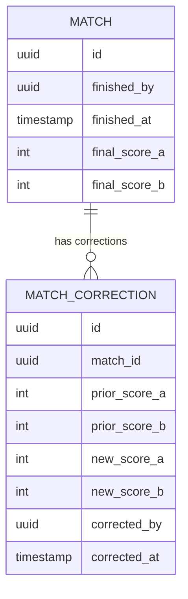

# Audit & Trust - Plan

## Goal Capsule

- **Objective:** Make match completion and score corrections publicly visible and traceable, so disputed results have evidence anyone can check without asking panitia.
- **Product authority:** `STRATEGY.md` — Track "Audit & trust" and metric "Koreksi manual bracket". Extends [docs/plans/2026-07-01-001-feat-live-data-engine-plan.md](2026-07-01-001-feat-live-data-engine-plan.md) (R10/R11: finished-match audit snapshot) and [docs/plans/2026-07-01-002-feat-public-transparency-layer-plan.md](2026-07-01-002-feat-public-transparency-layer-plan.md) (U4: match public page).
- **Execution profile:** Standard. Builds on the Live Data Engine plan's schema (adds one table) and the Public Transparency Layer plan's match page (extends its rendering).
- **Open blockers:** None — Product Contract preservation: unchanged.

---

## Product Contract

### Summary

Extend the match public page with visible audit information: who marked the match finished and when, and — if the final score is later corrected — a visible history of each correction (old score, new score, who, when) with a marker flagging that the match was corrected. No automatic cascading of corrections into bracket or standings; that stays a manual panitia action.

### Problem Frame

`STRATEGY.md` names disputed results and unaudited bracket corrections as core failures of manual tournament management. The Live Data Engine plan already records who finished a match and when (R10), but that record was scoped as an internal snapshot, not a public-facing feature — and it said nothing about what happens when panitia corrects an already-finished match's score, which is exactly the moment a dispute is most likely to recur.

### Key Decisions

- **Audit information is public, not panitia-only.** Who finished a match and when is shown on the match's public page (extending the Public Transparency Layer plan), not hidden in an internal dashboard. This directly serves the transparency approach — anyone can check the record without asking panitia — at the cost of exposing which panitia member handled a given match to all viewers.
- **Score corrections after a match is finished are recorded as a visible history, not silently overwritten.** Each correction stores the old score, new score, who made it, and when. This is the audit trail's answer to STRATEGY.md's "koreksi manual bracket" metric — the correction itself becomes the countable, inspectable event.
- **Corrections do not cascade into bracket or standings automatically.** If a corrected match had already advanced a winner or fed into standings, fixing the downstream effect is a manual panitia action outside this feature. This avoids building reversal logic that could chain across multiple dependent matches.
- **A corrected match displays a visual marker on its public page.** Because corrections don't cascade, a corrected match's score can temporarily disagree with its position in the bracket. The marker surfaces this risk to viewers rather than leaving a silent inconsistency; it does not resolve the inconsistency, which stays panitia's job.

### Actors

- A1. **Panitia/admin** — marks matches finished, corrects final scores after the fact.
- A2. **Penonton (spectator/public) / Pemain** — views audit information and correction history on match public pages, per the Public Transparency Layer plan.

### Requirements

**Finish audit visibility**

- R1. A match's public page shows who marked it finished and when, alongside its final score.

**Correction history**

- R2. Panitia can correct a finished match's final score after the fact.
- R3. Each correction is recorded with the prior score, the new score, who made the correction, and when.
- R4. A match's public page shows its full correction history (if any), not just the current score.
- R5. A match that has been corrected displays a visible marker on its public page distinguishing it from an uncorrected match.

**Non-cascading scope**

- R6. Correcting a finished match's score does not automatically change bracket advancement or standings that were already derived from the prior score.

### Key Flows

- F1. **Panitia corrects a finished match**
  - **Trigger:** Panitia notices a finished match's recorded score was wrong.
  - **Actors:** A1, A2
  - **Steps:** Panitia submits a corrected score (R2) → system records old score, new score, who, when (R3) → match's public page updates to show new score, full correction history, and a corrected-match marker (R4, R5) → bracket/standings remain as they were, unaffected by the correction (R6) → panitia manually fixes any downstream bracket/standings effect outside this feature.
  - **Covers:** R2, R3, R4, R5, R6

### Scope Boundaries

**Outside this feature's identity**

- Automatic cascading correction of bracket advancement or standings when a finished match's score changes — always a manual panitia action.
- Per-point/per-goal audit history during a live, not-yet-finished match — unchanged from the Live Data Engine plan; only the finished-match snapshot and any subsequent corrections are audited.

---

## Planning Contract

### Key Technical Decisions

- **KTD1. A separate `match_corrections` table, one row per correction.** Matches the relational pattern already established across the Live Data Engine and Public Transparency Layer plans, and was already anticipated as a deferred table name in the Live Data Engine plan's U1 notes. Easier to query and render as a list (R4) than a JSON column would be.
- **KTD2. The "corrected" marker (R5) is derived by querying for existing rows in `match_corrections`, not a synced flag on `matches`.** Consistent with the read-query pattern established by `get-standings` and `get-bracket-public` in prior plans — avoids a second write path that could drift out of sync with the correction history itself.
- **KTD3. Correcting a match's score is a separate write path from the original finish-marking action, sharing the same RLS write boundary.** `mark-finished` (Live Data Engine U5/U6 trigger path) and `correct-score` (this plan) are distinct panitia actions; RLS policies restrict both to authenticated panitia scoped to their own event/competition, per the Live Data Engine plan's KTD6.

### High-Level Technical Design

### Assumptions

- The Live Data Engine plan's U1 (schema/RLS) and U5/U6 (finish-triggered advancement/standings) are implemented before this plan's units are exercised — this plan's `correct-score` action explicitly does not re-trigger those.
- The Public Transparency Layer plan's U4 (match live view page) exists as the extension point for rendering audit info and correction history.

### Sequencing

U1 (schema) has no dependency beyond Live Data Engine's U1 and can land first. U2 (correction action) depends on U1. U3 (public page extension) depends on U1 and on Public Transparency Layer's U4.

---

## Implementation Units

### U1. Match corrections schema

- **Goal:** Add the `match_corrections` table to record each post-finish score correction.
- **Requirements:** R3 (A1)
- **Dependencies:** Live Data Engine plan's U1 (matches table must exist).
- **Files:**
  - `supabase/migrations/0006_match_corrections.sql` (new)
- **Approach:** `match_corrections` table: `match_id` (FK to `matches`), `prior_score_a`/`prior_score_b`, `new_score_a`/`new_score_b`, `corrected_by` (FK to panitia user), `corrected_at` (timestamp, default now). RLS: INSERT restricted to authenticated panitia scoped to the match's event/competition (mirrors Live Data Engine's KTD6); SELECT open to anon and authenticated, matching the public-audit Key Decision.
- **Test scenarios:**
  - Happy path: an authenticated panitia scoped to a match's competition can INSERT a correction row.
  - Edge case: a panitia not associated with the match's competition cannot INSERT (RLS denies), mirroring Live Data Engine's U1 RLS test pattern.
  - Happy path: anon-role SELECT on `match_corrections` succeeds (supports public visibility, R4).
- **Verification:** Migration applies cleanly; RLS scenarios verified the same way as Live Data Engine's U1 (role-switched queries).

### U2. Score correction action

- **Goal:** Let panitia correct a finished match's final score, recording the correction and updating the match's current score.
- **Requirements:** R2, R3, R6 (A1)
- **Dependencies:** U1.
- **Files:**
  - `src/lib/matches/correct-score.ts` (new)
  - `src/lib/matches/correct-score.test.ts` (new)
- **Approach:** A Server Action requiring the match to already be `finished` (guards against using this path on a `live` match — live scores use the Live Data Engine plan's `update-live-score` instead). On call: read the match's current final score as `prior_score`, INSERT a `match_corrections` row with prior/new scores and the calling panitia's id, then UPDATE the match's `final_score_a`/`final_score_b` fields. Deliberately does **not** touch `next_match_id` advancement or trigger standings recalculation (R6) — those remain whatever the original `finished` transition already set.
- **Technical design:** Directional sketch — `correct-score(matchId, newScoreA, newScoreB)`: assert `match.status === 'finished'`; INSERT `match_corrections` row (prior = current final score, new = argument); UPDATE `matches` final score fields only, no status or `next_match_id` change.
- **Patterns to follow:** Server Actions convention from Live Data Engine plan's U2/U4; RLS-scoped write pattern from U1 above.
- **Test scenarios:**
  - Happy path: correcting a finished match's score inserts a `match_corrections` row with correct prior/new values and updates the match's displayed final score.
  - Edge case: attempting to correct a `live` (not yet finished) match is rejected — this action only operates on finished matches.
  - Edge case: correcting the same match's score twice produces two `match_corrections` rows, each with its own prior/new pair (the second correction's prior score is the first correction's new score).
  - Integration: correcting a bracket match's score that already triggered advancement does not modify the next match's populated slot (verifies R6 against Live Data Engine's U5 trigger).
  - Integration: correcting a league match's score does not change the standings computed by `get-standings` from Live Data Engine's U6 (verifies R6 against that read path).
- **Verification:** Unit tests on `correct-score.ts` for all scenarios above, including the two integration checks against U5/U6 behavior from the Live Data Engine plan.

### U3. Public audit and correction history display

- **Goal:** Extend the match public page to show finish-audit info and, if present, the full correction history with a corrected-match marker.
- **Requirements:** R1, R4, R5 (A2)
- **Dependencies:** U1; Public Transparency Layer plan's U4.
- **Files:**
  - `src/lib/matches/get-match-public.ts` (modify — Public Transparency Layer plan's U4 file; extend the existing query)
  - `src/lib/matches/get-match-public.test.ts` (modify)
- **Approach:** Extend the Public Transparency Layer plan's `get-match-public` query to also fetch `finished_by`/`finished_at` (already present on `matches` per Live Data Engine's U1) and any related `match_corrections` rows, ordered by `corrected_at`. The match page component (Public Transparency Layer's U4) renders finish-audit info always, and the correction history plus marker only when `match_corrections` rows exist (per KTD2 — no separate flag to check).
- **Patterns to follow:** Extends the existing `get-match-public` read path rather than introducing a parallel one.
- **Test scenarios:**
  - Happy path: a finished, uncorrected match's public page shows who finished it and when, with no correction history section rendered.
  - Happy path: a corrected match's public page shows the correction history (prior/new scores, who, when for each correction) and the corrected-match marker.
  - Edge case: a match with two corrections shows both in the history, in chronological order.
- **Verification:** Unit tests on the extended `get-match-public.ts` covering the scenarios above; reuse of Public Transparency Layer's U4 rendering test pattern.

---

## Verification Contract

| Command | Applies to | Notes |
|---|---|---|
| `npm run lint` | All units | ESLint via `eslint.config.mjs`. |
| `npx tsc --noEmit` | All units | Strict-mode type check per `tsconfig.json`. |
| Supabase migration apply | U1 | Confirms the corrections table and RLS apply cleanly on top of the Live Data Engine plan's schema. |
| Unit/integration test suite for touched files | Each unit | Same test runner selected during Live Data Engine plan's U1 setup. |

## Definition of Done

- All three units (U1–U3) implemented, with each unit's test scenarios passing.
- `npm run lint` and `npx tsc --noEmit` pass with no errors.
- R6 verified concretely: a correction to a bracket match with existing advancement, and a correction to a league match with existing standings, both leave those downstream artifacts unchanged.
- No dead-end or experimental code from abandoned approaches remains in the diff.

---

## Sources & Research

- No new external research was load-bearing for this plan — it reuses the schema, RLS, and Realtime patterns already researched and decided in the Live Data Engine plan.
