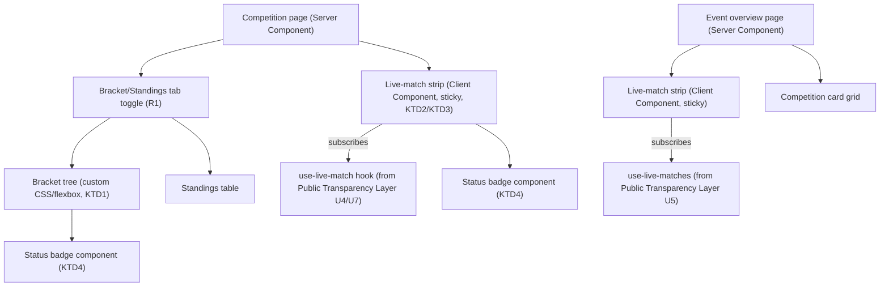

# Live View UI/UX - Plan

## Goal Capsule

- **Objective:** Give the Public Transparency Layer's pages a concrete visual structure — how bracket, standings, live matches, and correction info are laid out — so front-end implementation doesn't need to invent layout decisions.
- **Product authority:** `STRATEGY.md` — Our approach (real-time transparency). Extends [docs/plans/2026-07-01-002-feat-public-transparency-layer-plan.md](2026-07-01-002-feat-public-transparency-layer-plan.md) (R1, R2, R4, R5, R7 — the pages this UI renders) and [docs/plans/2026-07-01-003-feat-audit-trust-plan.md](2026-07-01-003-feat-audit-trust-plan.md) (R5 — corrected-match marker).
- **Execution profile:** Standard. Pure presentation layer over data-access functions already planned in the Live Data Engine and Public Transparency Layer plans — no new data-fetching logic, only component structure and styling scaffolding.
- **Open blockers:** None — Product Contract preservation: unchanged.

---

## Product Contract

### Summary

The Competition page uses bracket/standings as the primary focus: a tab toggles between Bracket and Standings views, with a sticky live-match strip beneath that stays visible on scroll. The Event overview page mirrors this pattern — a sticky live-match strip as a separate headline above a grid of Competition cards. Match cards carry only one visually prominent status (live); pending, finished, and corrected states are distinguished by text/icon labels, not color. The corrected-match marker only appears on a match's own detail page, not inside bracket slots.

### Problem Frame

The Public Transparency Layer plan defines what data these pages must show (bracket, standings, live scores, correction history) but not how it's laid out. Without a visual structure, front-end implementation would need to invent layout decisions ad hoc, risking inconsistency between the Event and Competition pages and ambiguity about how prominent "live" status should be versus other match states.

### Key Decisions

- **Bracket/standings is the primary visual focus of the Competition page, not a secondary element behind a match list.** Matches how tournament/esports sites conventionally present this information, and keeps the page anchored to the Live Data Engine plan's bracket-advancement and standings-recalculation mechanics as the thing being visualized.
- **A live-match strip is a separate, visually distinct element from the bracket/grid — not a feed intermixed with match/Competition cards, and not a bare inline badge.** This is a repeated pattern across both the Competition page (strip beneath the bracket/standings tabs) and the Event page (strip above the Competition grid), so viewers learn the pattern once and recognize it in both places.
- **The live-match strip is sticky (stays visible on scroll) on both pages.** Brackets can be tall (many rounds); without stickiness, the live strip would scroll out of view exactly when a viewer is deep in the bracket — undermining the real-time-visibility goal from `STRATEGY.md`.
- **Only the "live" status gets a visually prominent treatment (e.g., color, strong indicator).** Pending, finished, and corrected states are distinguished by text/icon labels rather than dedicated colors. This keeps the visual system simple — one state to design prominently, the rest read as plain information.
- **The corrected-match marker (Audit & Trust plan's R5) appears only on a match's own detail page, not inside bracket slots.** Keeps bracket slots scannable at a glance; a viewer who wants to know if a specific match was corrected opens that match.

### Actors

- A1. **Penonton (spectator/public) / Pemain** — the viewer these layouts serve, per the Public Transparency Layer plan's A1/A2.

### Requirements

**Competition page layout**

- R1. The Competition page shows a tab toggle between Bracket view and Standings view, matching whichever format (bracket or league) the Competition uses per the Public Transparency Layer plan's R4/R5.
- R2. A live-match strip appears beneath the bracket/standings tab content, listing matches currently in progress within that Competition.
- R3. The live-match strip remains visible while the viewer scrolls the bracket/standings content (sticky positioning).

**Event overview page layout**

- R4. The Event overview page shows a live-match strip as a distinct element above a grid of Competition cards, listing matches currently in progress across all Competitions in the Event (per the Public Transparency Layer plan's R2).
- R5. The live-match strip on the Event page remains visible while the viewer scrolls the Competition grid (sticky positioning).

**Match status visual treatment**

- R6. A match in `live` status is visually distinguished with a prominent treatment (color or strong indicator), both in the live-match strip and within bracket slots.
- R7. Matches in `pending`, `finished`, or `corrected` status are distinguished from each other by text or icon labels, not by dedicated prominent styling.
- R8. A corrected-match indicator (per the Audit & Trust plan's R5) appears only on the match's own detail page — bracket slots do not show a correction indicator.

### Key Flows

- F1. **Spectator scans a Competition's bracket while matches are live**
  - **Trigger:** Penonton opens a Competition page with one or more matches currently live.
  - **Actors:** A1
  - **Steps:** Bracket/Standings tab renders per the Competition's format (R1) → live-match strip shows currently in-progress matches beneath it (R2) → viewer scrolls through bracket rounds; the strip stays visible throughout (R3) → live matches stand out visually in both the strip and bracket slots (R6); other statuses read as plain labels (R7).
  - **Covers:** R1, R2, R3, R6, R7

- F2. **Spectator checks an Event with parallel live Competitions**
  - **Trigger:** Penonton opens an Event's overview page.
  - **Actors:** A1
  - **Steps:** Live-match strip shows in-progress matches across all Competitions (R4) → viewer scrolls the Competition grid below; the strip stays visible (R5) → viewer drills into a specific Competition (transitions to F1).
  - **Covers:** R4, R5

### Scope Boundaries

**Deferred for later**

- Final visual design — colors, typography, spacing, component library choices. This plan fixes structure and status-treatment rules only; visual polish is implementation-time work guided by these constraints, not specified here.
- Dashboard panitia UI/UX — this plan covers only the public live-view side (Public Transparency Layer), not the admin/panitia interface.

**Outside this feature's identity**

- Any per-status color coding beyond the single "live" treatment (R6/R7 rule out this direction explicitly).

---

## Planning Contract

### Key Technical Decisions

- **KTD1. Bracket tree is rendered with custom CSS/flexbox, no third-party bracket library.** Full control over structure matching the agreed wireframe (round columns, simple connecting lines) and no new dependency; a generic library's assumptions may not fit this project's Event/Kontingen data shape.
- **KTD2. The live-match strip uses CSS `position: sticky`, with no scroll-driven collapse/expand logic.** Simplest implementation that satisfies R3/R5; no JS scroll listener needed.
- **KTD3. Pages are React Server Components with small Client Component islands for Realtime-subscribed parts only.** The bracket/standings structure and Competition grid render server-side (fast initial paint, matches `CLAUDE.md`'s "Server Components by default" convention); only the live-match strip and any live-updating score display are `'use client'`, wrapping the Public Transparency Layer plan's `use-live-match` hook (its U4/U7).
- **KTD4. Status-treatment styling (R6/R7) is implemented as a small shared status-badge component, not per-page duplicated markup.** One component renders the prominent "live" treatment or a plain text/icon label for `pending`/`finished`/`corrected`, reused across bracket slots, the live strip, and match detail pages — keeping the "only live is prominent" rule enforced in one place rather than risking drift across call sites.
- **KTD5. Radix UI primitives back any interactive base component this UI needs (tabs, tooltips), with Tailwind for styling.** Chosen for built-in accessibility (focus management, ARIA, keyboard navigation) rather than hand-rolling those behaviors. This plan's own components (badge, bracket tree, strip) are simple enough not to need a primitive, but the Bracket/Standings tab toggle (R1) uses Radix's `Tabs` primitive rather than custom tab logic.
- **KTD6. Vitest + React Testing Library is the test runner for this plan's units.** No test runner existed in the repo before this decision; chosen for its lighter configuration in a Next.js/Vite-adjacent ecosystem over Jest. Applies repo-wide, not just to this plan — see the Live Data Engine plan's Verification Contract, which deferred this exact choice.

### High-Level Technical Design

### Assumptions

- The Public Transparency Layer plan's U2–U5 (route shell, Competition view, match view, Event live highlight) exist as the data-access seams this UI composes over.
- The status-badge component (KTD4) is a new shared component, not extending an existing design-system primitive — the repo currently has no component library beyond default Next.js scaffolding.

### Sequencing

U1 (shared status-badge component) has no dependency and should land first since U2 and U3 both use it. U2 (Competition page layout) and U3 (Event overview page layout) can proceed in parallel once U1 lands, both depending on the Public Transparency Layer plan's route/data units.

---

## Implementation Units

### U1. Shared match-status badge component

- **Goal:** Build the single shared component that renders a match's status — prominent treatment for `live`, plain text/icon label for `pending`/`finished`/`corrected` — reused across all other units.
- **Requirements:** R6, R7, R8 (A1)
- **Dependencies:** None.
- **Files:**
  - `src/components/match-status-badge.tsx` (new)
  - `src/components/match-status-badge.test.tsx` (new)
- **Approach:** A single component accepting a match's status (and, for `corrected`, whether a correction indicator should render — gated by where it's used per R8) and rendering the appropriate treatment. Server Component by default (pure presentational, no client state).
- **Test scenarios:**
  - Happy path: rendering with `status: 'live'` produces the prominent treatment (test checks for the distinguishing class/element, not exact color).
  - Happy path: rendering with `status: 'pending'`, `'finished'` each produce a plain text/icon label, visually distinct from the `live` treatment.
  - Edge case: rendering with `status: 'finished'` and a `corrected: true` flag renders the corrected label only when the component is explicitly told to show it (supports R8 — bracket-slot usage passes `corrected: false`/omits the flag; match-detail-page usage passes it through).
- **Verification:** Component unit tests covering all status/flag combinations above.

### U2. Competition page layout

- **Goal:** Build the Competition page combining the Bracket/Standings tab toggle, custom bracket rendering, and the sticky live-match strip.
- **Requirements:** R1, R2, R3 (A1)
- **Dependencies:** U1; Public Transparency Layer plan's U2, U3.
- **Files:**
  - `src/app/(public)/t/[eventSlug]/c/[competitionId]/page.tsx` (modify — Public Transparency Layer plan's U3 file; add layout structure)
  - `src/components/bracket-tree.tsx` (new)
  - `src/components/live-match-strip.tsx` (new — `'use client'`)
  - `src/components/live-match-strip.test.tsx` (new)
- **Approach:** Page stays a Server Component (KTD3), fetching bracket/standings data via the Public Transparency Layer plan's `get-bracket-public` (U3). `bracket-tree.tsx` renders the round-column CSS/flexbox structure per KTD1, using U1's badge component per bracket slot. `live-match-strip.tsx` is the one Client Component on this page, subscribing to the Public Transparency Layer plan's `use-live-match` hook and rendering with `position: sticky` (KTD2), using U1's badge component for the prominent live treatment.
- **Patterns to follow:** Server/Client boundary convention from `CLAUDE.md` ("Server Components by default; add 'use client' only when needed").
- **Test scenarios:**
  - Happy path: a Competition with `format: bracket_single` renders the Bracket tab active by default with `bracket-tree.tsx`; a league-format Competition renders the Standings tab active by default (R1).
  - Happy path: a Competition with two live matches shows both in the live-match strip (R2).
  - Integration: the live-match strip remains rendered (not unmounted) as the page scrolls — verified via the sticky CSS class being present, not a scroll-simulation test (R3 is a CSS behavior, not app logic).
  - Edge case: a Competition with zero live matches renders an empty strip state, not an error.
- **Verification:** Unit test on `live-match-strip.tsx`'s rendering logic; visual/manual check that `bracket-tree.tsx` matches the agreed wireframe structure (round columns, not a list).

### U3. Event overview page layout

- **Goal:** Build the Event overview page combining the sticky live-match strip and the Competition card grid.
- **Requirements:** R4, R5 (A1)
- **Dependencies:** U1; Public Transparency Layer plan's U2, U5.
- **Files:**
  - `src/app/(public)/t/[eventSlug]/page.tsx` (modify — Public Transparency Layer plan's U2 file; add layout structure for the `is_standalone: false` branch)
  - `src/components/competition-card.tsx` (new)
- **Approach:** Reuses `live-match-strip.tsx` from U2 (same component, different data scope — Event-wide via the Public Transparency Layer plan's `get-live-matches` from U5, rather than Competition-scoped). `competition-card.tsx` is a Server Component rendering one Competition's summary (name, format, participant count) in the grid.
- **Patterns to follow:** Reuses U2's `live-match-strip.tsx` rather than duplicating a second sticky-strip implementation.
- **Test scenarios:**
  - Happy path: an Event with three Competitions renders three `competition-card` instances in the grid (R4's grid half).
  - Happy path: the live-match strip, reused from U2 but scoped to `get-live-matches`, shows matches across multiple Competitions (R4's strip half).
  - Edge case: an Event with no live matches anywhere shows the strip's empty state (same component behavior as U2's edge case).
- **Verification:** Unit test on `competition-card.tsx` rendering; confirms `live-match-strip.tsx` is reused (not duplicated) by checking the import.

---

## Verification Contract

| Command | Applies to | Notes |
|---|---|---|
| `npm run lint` | All units | ESLint via `eslint.config.mjs`. |
| `npx tsc --noEmit` | All units | Strict-mode type check per `tsconfig.json`. |
| `npx vitest run` | Each unit | Vitest + React Testing Library, per KTD6. |

## Definition of Done

- All three units (U1–U3) implemented, with each unit's test scenarios passing.
- `npm run lint` and `npx tsc --noEmit` pass with no errors.
- Visual check confirms the Competition and Event pages match the agreed wireframe structure (tab + sticky strip; strip + grid respectively) — not pixel-perfect, but structurally correct.
- `live-match-strip.tsx` is a single shared component used by both U2 and U3, not duplicated.
- No dead-end or experimental code from abandoned approaches remains in the diff.

---

## Sources & Research

- No new external research was load-bearing for this plan — component boundaries follow `CLAUDE.md`'s existing Server/Client Component convention, and data access reuses functions already planned in the Live Data Engine and Public Transparency Layer plans.
