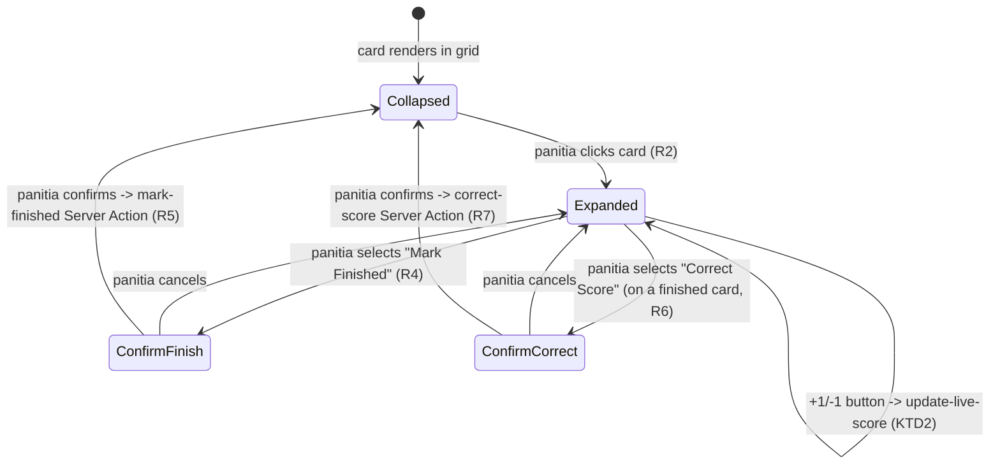

# Panitia Dashboard UI/UX - Plan

## Goal Capsule

- **Objective:** Give panitia a visual structure for managing live matches within an Event/Competition — a "control room" view plus the interaction pattern for live scoring, marking matches finished, and correcting scores — so front-end implementation doesn't need to invent this layout.
- **Product authority:** `STRATEGY.md` — Our approach (real-time transparency via bracket automation and audit trail). Extends [docs/plans/2026-07-01-001-feat-live-data-engine-plan.md](2026-07-01-001-feat-live-data-engine-plan.md) (R5, R7 — live scoring and marking finished) and [docs/plans/2026-07-01-003-feat-audit-trust-plan.md](2026-07-01-003-feat-audit-trust-plan.md) (R2 — score correction).
- **Execution profile:** Standard. Front-end layer over Server Actions already planned in the Live Data Engine and Audit & Trust plans — no new data-mutation logic, only component structure and interaction wiring.
- **Open blockers:** None — Product Contract preservation: unchanged.

---

## Product Contract

### Summary

A control-room page, scoped to one Event or Competition at a time, shows every match as a card in a grid. Clicking a card expands it in place to reveal live-scoring controls (+1/-1 buttons per side), a "Mark Finished" action, and — for already-finished matches — a "Correct Score" action. Both "Mark Finished" and "Correct Score" require an explicit confirmation dialog before submitting, because each has an irreversible or publicly visible consequence.

### Problem Frame

Panitia manage many matches at once during a tournament, not one at a time — a linear one-match-at-a-time flow would force constant navigation away from the overview. At the same time, two actions in this dashboard (marking a match finished, correcting a finished match's score) have consequences that aren't easily undone: marking finished triggers automatic bracket advancement or standings recalculation (per the Live Data Engine plan's KTD5), and a correction is permanently recorded in a public history (per the Audit & Trust plan). The dashboard needs to support fast, high-volume interaction for routine live scoring while still protecting against accidental submission of the two consequential actions.

### Key Decisions

- **The control room is scoped to one Event or Competition at a time, not a global cross-tournament view.** Panitia open a specific Event/Competition first, then see all of its matches. Simpler navigation, matching how panitia work through one event at a time rather than managing many simultaneously.
- **Matches render as a card grid; clicking a card expands it in place to reveal controls, rather than opening a drawer or a separate kanban-style board.** Keeps surrounding match cards visible while a panitia works one match at a time, without losing the overview.
- **Live score entry uses +1/-1 buttons per side, not manual numeric typing.** Matches the Live Data Engine plan's R5 (incremental per-point/goal updates) — buttons are faster for repeated updates during a live match than retyping a number each time.
- **"Mark Finished" and "Correct Score" both require an explicit confirmation dialog before submitting.** Both actions have consequences a panitia can't casually undo (automatic bracket/standings changes, or a permanent public correction record) — the dialog is a deliberate pause before an action that's cheap to get wrong and costly to reverse.

### Actors

- A1. **Panitia/admin** — the sole user of this dashboard, per the Live Data Engine plan's A1.

### Requirements

**Control room layout**

- R1. A panitia opens a control room scoped to one Event or Competition, showing every match in that scope as a card in a grid.
- R2. Clicking a match card expands it in place (not a separate page, drawer, or modal) to reveal that match's controls.

**Live scoring interaction**

- R3. An expanded card for a `live` (or not-yet-started, upon first score entry) match shows +1/-1 controls for each side's score.
- R4. An expanded card shows a "Mark Finished" action, available once the match has a score.

**Confirmation for consequential actions**

- R5. Selecting "Mark Finished" opens a confirmation dialog stating the action will trigger automatic bracket/standings advancement; submission only proceeds on explicit confirmation.
- R6. An expanded card for an already-`finished` match shows a "Correct Score" action.
- R7. Selecting "Correct Score" and submitting a new score opens a confirmation dialog stating the correction will be permanently recorded and publicly visible; submission only proceeds on explicit confirmation.

### Key Flows

- F1. **Panitia updates a live match's score and marks it finished**
  - **Trigger:** Panitia opens the control room for a Competition with matches in progress.
  - **Actors:** A1
  - **Steps:** Panitia sees all matches as cards (R1) → clicks the card for a live match, which expands in place (R2) → uses +1/-1 controls to update the score as the match progresses (R3) → selects "Mark Finished" (R4) → confirms in the resulting dialog (R5) → match transitions to finished and the card collapses back to its grid state.
  - **Covers:** R1, R2, R3, R4, R5

- F2. **Panitia corrects a finished match's score**
  - **Trigger:** Panitia notices a finished match's recorded score was wrong.
  - **Actors:** A1
  - **Steps:** Panitia clicks the finished match's card, which expands to show "Correct Score" (R6) → enters the corrected score → confirms in the resulting dialog (R7) → correction is recorded per the Audit & Trust plan's R2/R3.
  - **Covers:** R6, R7

### Scope Boundaries

**Deferred for later**

- Final visual design — colors, typography, spacing, exact card sizing. This plan fixes interaction structure only.
- Turnamen/Event/Competition/Kontingen creation and management UI (forms for creating these entities) — this plan covers only the live-match control room, not setup screens.
- A global, cross-tournament view of all active matches — explicitly out of scope per the Key Decisions; the control room is always scoped to one Event/Competition.

**Outside this feature's identity**

- Undo functionality for "Mark Finished" or "Correct Score" — the confirmation dialog is the safeguard; this plan does not add a post-submission undo.

---

## Planning Contract

### Key Technical Decisions

- **KTD1. The control-room page is a Server Component; each match card is an individual Client Component.** Matches the minimal-client-boundary pattern from the Live View UI plan's KTD3 — the page fetches the initial match list server-side, but expand/collapse state, score-button interaction, and dialog open/close all live in each card's own client state, isolated per match.
- **KTD2. Score buttons call the Live Data Engine plan's `update-live-score` Server Action immediately per click — no local buffering or a separate "Save" step.** Matches that plan's R6 (live updates visible without refresh-cadence delay) and avoids a panitia losing unsaved taps if they navigate away mid-match.
- **KTD3. "Mark Finished" and "Correct Score" are separate confirmation-gated actions, each wrapping its respective Server Action from the Live Data Engine plan (`mark-finished`, U5/U6 trigger) and the Audit & Trust plan (`correct-score`, U2).** The dialog is local UI state in the card component; only on explicit confirm does the card call the underlying Server Action — this plan adds no new mutation logic, only the confirmation gate in front of existing actions.
- **KTD4. `confirm-action-dialog.tsx` (U2) is built on Radix UI's `Dialog` primitive, not a hand-rolled modal.** Both gated actions are irreversible or publicly visible, so correct focus trapping, ESC-to-cancel, and ARIA semantics matter more here than typical UI chrome — Radix provides these rather than requiring them to be re-implemented and re-verified per dialog.
- **KTD5. Vitest + React Testing Library is the test runner for this plan's units** (same repo-wide choice as the Live View UI plan's KTD6).

### High-Level Technical Design

### Assumptions

- The Live Data Engine plan's U2–U6 (Event/Competition CRUD, live scoring, bracket advancement, standings) and the Audit & Trust plan's U2 (`correct-score`) are implemented as the Server Actions this dashboard's cards call.
- Panitia authentication (Supabase Auth, per the Live Data Engine plan's assumption) gates access to this dashboard's routes; this plan does not design the login screen itself.

### Sequencing

U1 (match card component with expand/collapse and score controls) has no dependency beyond the Live Data Engine plan's U4 (`update-live-score`) and should land first. U2 (confirmation dialogs for Mark Finished / Correct Score) depends on U1. U3 (control-room page assembling the grid) depends on U1 and U2.

---

## Implementation Units

### U1. Match card component with expand/collapse and live scoring

- **Goal:** Build the individual match-card Client Component: collapsed grid state, expand-in-place on click, and +1/-1 score controls when expanded.
- **Requirements:** R2, R3 (A1)
- **Dependencies:** Live Data Engine plan's U4 (`update-live-score`).
- **Files:**
  - `src/components/panitia/match-card.tsx` (new)
  - `src/components/panitia/match-card.test.tsx` (new)
- **Approach:** A Client Component holding local `expanded` state. Collapsed view shows match summary (participants, current status via the Live View UI plan's `match-status-badge`); expanded view adds +1/-1 buttons per side, each calling `update-live-score` directly on click (KTD2), with the displayed score updating optimistically or on the action's response.
- **Patterns to follow:** Reuses `match-status-badge` from the Live View UI plan's U1 rather than duplicating status styling.
- **Test scenarios:**
  - Happy path: clicking a collapsed card sets `expanded: true` and reveals score controls (R2).
  - Happy path: clicking a `+1` button for side A calls `update-live-score` with an incremented score for side A.
  - Edge case: clicking `-1` when a side's score is already 0 does not go negative (client-side guard, in addition to any server-side validation).
  - Integration: after `update-live-score` resolves, the card's displayed score reflects the new value (not stale from before the call).
- **Verification:** Component unit tests covering expand/collapse and score-button scenarios above, mocking `update-live-score`.

### U2. Confirmation dialogs for Mark Finished and Correct Score

- **Goal:** Add the "Mark Finished" and "Correct Score" actions to an expanded card, each gated by an explicit confirmation dialog before calling its underlying Server Action.
- **Requirements:** R4, R5, R6, R7 (A1)
- **Dependencies:** U1.
- **Files:**
  - `src/components/panitia/match-card.tsx` (modify — extends U1's component)
  - `src/components/panitia/confirm-action-dialog.tsx` (new — shared dialog shell)
  - `src/components/panitia/match-card.test.tsx` (modify)
- **Approach:** `confirm-action-dialog.tsx` is a small shared dialog component taking a message and confirm/cancel handlers, reused for both actions (KTD3) rather than two bespoke dialogs. An expanded `live` (or scored `pending`) card shows "Mark Finished" (R4); selecting it opens the dialog stating bracket/standings will update automatically (R5), confirming calls the Live Data Engine plan's `mark-finished`. An expanded `finished` card shows "Correct Score" (R6) instead of live-scoring controls; submitting a new score opens the dialog stating the correction is permanent and public (R7), confirming calls the Audit & Trust plan's `correct-score`.
- **Test scenarios:**
  - Happy path: selecting "Mark Finished" opens the confirmation dialog; confirming calls `mark-finished` and the card returns to collapsed state.
  - Happy path: canceling the "Mark Finished" dialog leaves the card expanded and unfinished, with no Server Action called.
  - Happy path: on a finished card, submitting a corrected score opens the confirmation dialog; confirming calls `correct-score`.
  - Edge case: an expanded card for a `finished` match does not show +1/-1 live-scoring controls — only "Correct Score" (mutually exclusive with U1's live controls per match status).
  - Integration: `confirm-action-dialog.tsx` is the same component instance type used for both actions, verified by checking both call sites import it rather than a duplicated dialog.
- **Verification:** Unit tests on the extended `match-card.tsx` covering all scenarios above; a rendering test confirming `confirm-action-dialog.tsx` is shared, not duplicated.

### U3. Control-room page

- **Goal:** Assemble the Server Component page that fetches all matches in a scoped Event/Competition and renders them as a grid of `match-card` components.
- **Requirements:** R1 (A1)
- **Dependencies:** U1, U2.
- **Files:**
  - `src/app/(panitia)/events/[eventId]/control-room/page.tsx` (new)
  - `src/app/(panitia)/competitions/[competitionId]/control-room/page.tsx` (new)
- **Approach:** Server Component fetching all matches scoped to the given Event or Competition (per the Key Decision — never a global cross-tournament list), rendering one `match-card` per match in a grid layout. No client state at this level; all interactivity is isolated to each card (KTD1).
- **Test scenarios:**
  - Happy path: a Competition with five matches renders five `match-card` instances.
  - Edge case: a Competition with zero matches renders an empty grid state, not an error.
- **Verification:** Route-level test confirming the correct number of `match-card` instances render for a given scope's match count.

---

## Verification Contract

| Command | Applies to | Notes |
|---|---|---|
| `npm run lint` | All units | ESLint via `eslint.config.mjs`. |
| `npx tsc --noEmit` | All units | Strict-mode type check per `tsconfig.json`. |
| `npx vitest run` | Each unit | Vitest + React Testing Library, per KTD5. |

## Definition of Done

- All three units (U1–U3) implemented, with each unit's test scenarios passing.
- `npm run lint` and `npx tsc --noEmit` pass with no errors.
- Both confirmation dialogs verified to block their Server Action until explicit confirm (R5, R7).
- A finished match's expanded card shows "Correct Score" only, never live-scoring controls alongside it.
- No dead-end or experimental code from abandoned approaches remains in the diff.

---

## Sources & Research

- No new external research was load-bearing for this plan — component boundaries and interaction patterns reuse decisions already established in the Live Data Engine, Audit & Trust, and Live View UI plans.
