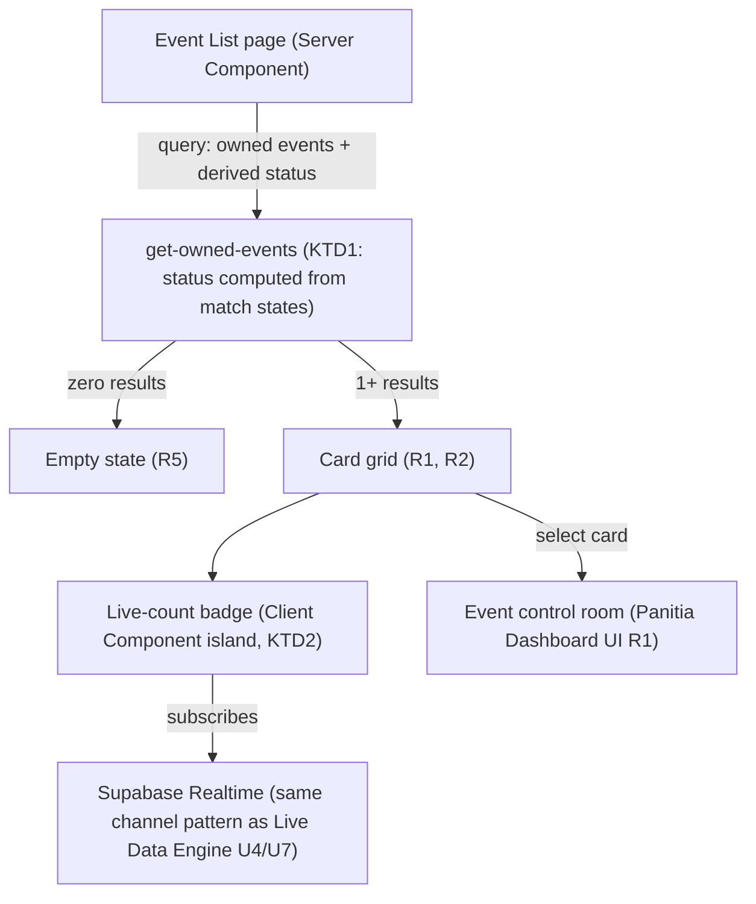

# Panitia Event List UI - Plan

## Goal Capsule

- **Objective:** Give panitia a landing page listing the Events/Tournaments they manage, closing the gap left by the login plan's redirect target (which assumed this page but didn't design it).
- **Product authority:** `STRATEGY.md` — panitia/admin as the sole authenticated actor. Fills the redirect destination assumed by [docs/plans/2026-07-02-002-feat-panitia-login-ui-plan.md](2026-07-02-002-feat-panitia-login-ui-plan.md) (R2) and precedes entry into [docs/plans/2026-07-02-001-feat-panitia-dashboard-ui-plan.md](2026-07-02-001-feat-panitia-dashboard-ui-plan.md)'s control room.
- **Execution profile:** Standard. Presentation and one derived-status query over existing schema (Live Data Engine plan) — no new tables.
- **Open blockers:** None — Product Contract preservation: unchanged. Multi-panitia-per-Event access is explicitly deferred (see Scope Boundaries) rather than resolved here, to avoid changing the Live Data Engine plan's already-implementation-ready RLS.

---

## Product Contract

### Summary

A card grid listing every Event the logged-in panitia owns, each card showing the Event name, a status badge (Berlangsung / Belum Mulai / Selesai), and — when applicable — a "N LIVE" badge for currently in-progress matches. A prominent "Buat Event Baru" action sits at the top of the page; when the panitia has no Events yet, the page shows a large centered empty state with the same action as its sole focus.

### Problem Frame

The Panitia Login UI plan's R2 (`redirects to the panitia's Event/Tournament list`) named this page as a destination but explicitly left it unplanned. Without it, a panitia has nowhere to land after logging in, and no way to see which of their Events currently need attention (live matches in progress) versus which are dormant.

### Key Decisions

- **Cards use a grid layout, matching the Competition-card grid pattern already established in the Public Transparency Layer plan.** Panitia see the same visual grammar on both sides of the product (their own list, and the public Competition grid), rather than learning two different list patterns.
- **Each card shows both a status badge and a live-count badge, not just one.** Status (Berlangsung/Belum Mulai/Selesai) tells panitia which Events are active at all; the "N LIVE" badge (reusing the pattern from the Live View UI plan's live-match strip) tells them which active Events need attention right now. Neither alone answers both questions.
- **One Event has exactly one owning panitia for this plan — no shared/multi-panitia access.** Extending ownership to multiple panitia accounts would require a new membership table and a change to the Live Data Engine plan's already-implementation-ready RLS policies (currently scoped to a single owning panitia). Deferred rather than resolved here (see Scope Boundaries).
- **The empty state (no Events yet) is a distinct, large centered layout with "Buat Event Baru" as its sole visual focus**, not a bare empty grid with a small button in the corner. Gives a first-time panitia one unambiguous next action.

### Actors

- A1. **Panitia/admin** — the sole viewer of this page, per the Live Data Engine plan's A1. Sees only Events they own.

### Requirements

**List view**

- R1. The page shows a grid of cards, one per Event the logged-in panitia owns.
- R2. Each card shows the Event's name and a status badge reflecting whether it is Berlangsung, Belum Mulai, or Selesai.
- R3. A card for an Event with one or more currently-live matches (across any of its Competitions) additionally shows a live-count badge (e.g., "2 LIVE").
- R4. A "Buat Event Baru" action is visible at the top of the page regardless of how many Events exist.

**Empty state**

- R5. When the panitia owns zero Events, the page shows a centered empty state with a message and the "Buat Event Baru" action as the primary visual element, replacing the card grid.

**Navigation**

- R6. Selecting an Event's card navigates to that Event's control room (per the Panitia Dashboard UI plan's R1).

### Key Flows

- F1. **Panitia lands after login and opens an active Event**
  - **Trigger:** Panitia is redirected here after a successful login (Panitia Login UI plan's R2).
  - **Actors:** A1
  - **Steps:** Page loads the grid of owned Events (R1) with status and live-count badges (R2, R3) → panitia selects the Event card showing live matches → navigates into that Event's control room (R6).
  - **Covers:** R1, R2, R3, R6

- F2. **First-time panitia with no Events**
  - **Trigger:** A newly authenticated panitia with no owned Events lands on this page.
  - **Actors:** A1
  - **Steps:** Page detects zero owned Events → shows the centered empty state with "Buat Event Baru" as the sole action (R5).
  - **Covers:** R4, R5

### Scope Boundaries

**Deferred for later**

- Multi-panitia access per Event (inviting a co-panitia to an existing Event) — would require a membership table and RLS changes to the Live Data Engine plan; not resolved in this plan.
- The "Buat Event Baru" UI itself (the creation form) — this plan only places the entry point (R4/R5); the form's design is a separate, unscoped brainstorm.

**Outside this feature's identity**

- Any Event editing or deletion affordance from this list view — this page is a landing/navigation surface, not a management surface.

---

## Planning Contract

### Key Technical Decisions

- **KTD1. Event status (Berlangsung/Belum Mulai/Selesai) is a computed value, not a stored column.** Derived from the aggregate state of a query joining that Event's matches: `Berlangsung` if any match is `live`; `Selesai` if every Competition's matches are all `finished` and none are `pending`/`live`; otherwise `Belum Mulai`. Consistent with the read-query pattern already used by `get-standings` and `get-bracket-public` in the Live Data Engine and Public Transparency Layer plans — no second write path to keep in sync.
- **KTD2. The page is a Server Component; the live-count badge is the only Client Component island.** The card grid (name, derived status) renders server-side from a single query. The "N LIVE" badge per card subscribes to Realtime for that Event's matches, matching the minimal-client-boundary pattern from the Live View UI plan's KTD3 and the Panitia Dashboard UI plan's KTD1.
- **KTD3. The query scopes to `events.owner_id = current panitia` (or equivalent), enforced by the same RLS pattern as the Live Data Engine plan's KTD6** — the page's query does not need an application-level ownership filter beyond what RLS already guarantees for the authenticated panitia's session.

### High-Level Technical Design

### Assumptions

- The Live Data Engine plan's U2 (Event/Competition CRUD) establishes `events.owner_id` or an equivalent ownership field this plan's query relies on — if the actual column name differs, the implementer adapts the query accordingly without changing this plan's intent.
- Panitia authentication (Panitia Login UI plan) is implemented before this page is reachable — this plan does not re-verify auth, it assumes an authenticated session per the Live Data Engine plan's RLS.

### Sequencing

U1 (owned-events query with derived status) has no dependency beyond the Live Data Engine plan's schema and should land first. U2 (page: grid, empty state, navigation) depends on U1. U3 (live-count badge) depends on U2 and can reuse the Live View UI plan's badge/Realtime pattern directly.

---

## Implementation Units

### U1. Owned-events query with derived status

- **Goal:** Build the read query returning a panitia's owned Events, each with a computed status (Berlangsung/Belum Mulai/Selesai) and live-match count.
- **Requirements:** R1, R2, R3 (A1)
- **Dependencies:** Live Data Engine plan's U1, U2 (schema, Event ownership).
- **Files:**
  - `src/lib/tournaments/get-owned-events.ts` (new)
  - `src/lib/tournaments/get-owned-events.test.ts` (new)
- **Approach:** Query `events` scoped to the authenticated panitia (RLS-enforced, KTD3), joined with `competitions`/`matches` to compute per-Event status and live count (KTD1). Returns one row per Event: `{ id, name, status, liveCount }`.
- **Test scenarios:**
  - Happy path: an Event with one live match and others pending returns `status: 'Berlangsung'`, `liveCount: 1`.
  - Happy path: an Event where every Competition's matches are all finished returns `status: 'Selesai'`.
  - Happy path: an Event with no matches started yet returns `status: 'Belum Mulai'`, `liveCount: 0`.
  - Edge case: a panitia with zero owned Events gets an empty array, not an error (supports R5).
  - Integration: a panitia querying this only receives Events they own — an Event owned by a different panitia never appears (verifies RLS scoping, KTD3).
- **Verification:** Unit tests on `get-owned-events.ts` against seeded multi-Event, multi-status data covering all scenarios above.

### U2. Event list page: grid, empty state, navigation

- **Goal:** Render the card grid or empty state from U1's query, with the "Buat Event Baru" action and card-to-control-room navigation.
- **Requirements:** R1, R2, R4, R5, R6 (A1)
- **Dependencies:** U1.
- **Files:**
  - `src/app/(panitia)/events/page.tsx` (new)
- **Approach:** Server Component (KTD2) calling `get-owned-events` (U1). Zero results renders the centered empty state (R5); one or more renders the card grid (R1) using design tokens/components already established (status badge styling per `CLAUDE.md`'s conventions). Each card links to the Event's control room route (Panitia Dashboard UI plan's U3, R6). The "Buat Event Baru" button (R4) is a static entry point — its target route/form is out of scope per this plan's Scope Boundaries.
- **Patterns to follow:** Design tokens and component conventions from `CLAUDE.md`'s Styling & Design Tokens section; card grid structure from the Live View UI plan's Event overview page (Public Transparency Layer plan's U2).
- **Test scenarios:**
  - Happy path: a panitia with three owned Events (mixed statuses) renders three cards, each with the correct status badge.
  - Happy path: a panitia with zero Events renders the empty state, not an empty grid.
  - Happy path: clicking a card navigates to that Event's control room route.
  - Edge case: an Event with `liveCount: 0` renders its card without a live-count badge (R3 — badge only appears when count > 0).
- **Verification:** Route-level test confirming grid vs. empty-state rendering based on `get-owned-events` result count, and correct navigation target per card.

### U3. Live-count badge (Client Component)

- **Goal:** Extract the live-count badge as an isolated Client Component subscribing to Realtime, so counts update without a page refresh.
- **Requirements:** R3 (A1)
- **Dependencies:** U2.
- **Files:**
  - `src/components/panitia/event-live-badge.tsx` (new)
  - `src/components/panitia/event-live-badge.test.tsx` (new)
- **Approach:** A small `'use client'` component taking an `eventId` and initial `liveCount`, subscribing to the same Realtime channel pattern established in the Live Data Engine plan's U4/U7 (scoped to matches within that Event's Competitions) to recompute the count on each relevant status change. Renders nothing when the count is 0.
- **Patterns to follow:** Realtime subscription pattern from the Live Data Engine plan's `use-live-match` hook, adapted to aggregate across an Event rather than a single match.
- **Test scenarios:**
  - Happy path: a badge initialized with `liveCount: 2` renders "2 LIVE".
  - Happy path: a badge initialized with `liveCount: 0` renders nothing (no empty badge shown).
  - Integration: a match within the Event transitioning to `live` via the subscribed channel increments the displayed count without a prop change from the parent.
- **Verification:** Unit test on initial render for both count states; integration test reusing the Live Data Engine plan's Realtime test pattern for the live-update scenario.

---

## Verification Contract

| Command | Applies to | Notes |
|---|---|---|
| `npm run lint` | All units | ESLint via `eslint.config.mjs`. |
| `npx tsc --noEmit` | All units | Strict-mode type check per `tsconfig.json`. |
| `npx vitest run` | All units | Vitest + React Testing Library, per the Live View UI plan's KTD6. |

## Definition of Done

- All three units (U1–U3) implemented, with each unit's test scenarios passing.
- `npm run lint` and `npx tsc --noEmit` pass with no errors.
- Manual check: a panitia with mixed-status Events sees correct badges per card, and the empty state renders correctly for a panitia with none.
- No dead-end or experimental code from abandoned approaches remains in the diff.

---

## Sources & Research

- No new external research was load-bearing — status derivation and Realtime subscription both reuse patterns already established and researched in the Live Data Engine and Public Transparency Layer plans.
